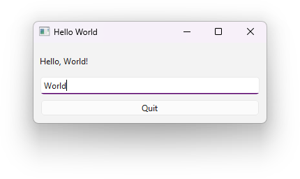
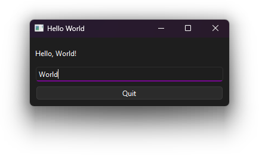
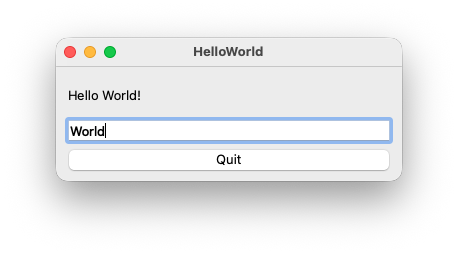
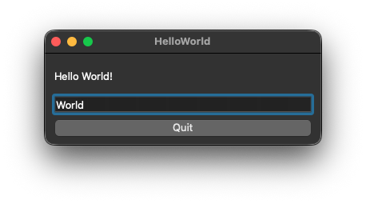

# Windows 11

## Accessibility

- Keyboard navigation: Works
- Unicode support: Works
- Screen reader support: Works (Tested with Narrator)
- Touch compatibility: Untested
- Gamepad compatibility: None

## Resource Usage / Start-up Time

Measured on an ASUS TUF Gaming F15 FX506HM with Windows 11.

- Size of executable: 36,1MiB (110KiB without dynamically linked dependencies)
- Ram Usage: 3.8MiB (jumps to 21,8MiB when entering emojis)
- Startup time: 94ms (Measured with https://github.com/Trinity2019/WinWordStartupTime/)

# macOS

## Accessibility

- Keyboard navigation: Works
- Unicode support: Works
- Screen reader support: Works (Tested with VoiceOver)
- Touch compatibility: Untested
- Gamepad compatibility: None

## Resource Usage / Start-up Time

Measured on a base model M4 Mac mini with macOS 26.2

- Size of executable: 47.44MiB (77.36KiB without dynamically linked dependencies)
- Ram Usage: 24.9 MiB
- Startup time: ~0.86s with profiling instrumentation

# Development Experience

This project was created with the QT creator and written in C++. It features a graphical designer with simple
drag-and-drop.

It's not fully self-explanatory on everything, but with enough online documentation to get you through the issues.

# Compatibility

Qt Widgets 6 is cross-compatible with Windows (10+), Linux and macOS (13+).
